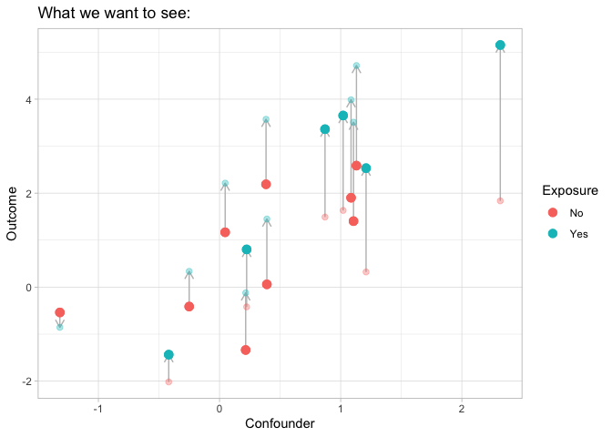
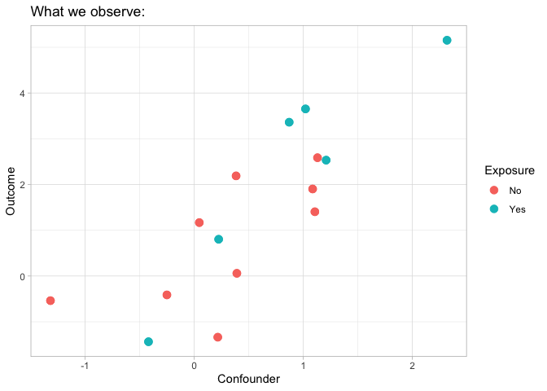

## 1. Data generative model of potential outcomes

### 1.1 Single binary exposure case

Suppose the residuals $\epsilon_i$ are independent and randomly drawn
from distribution $\mathcal{P}$, and $\mathbb{E}[\epsilon] = 0$.

The potential outcome of unit $i$ can maybe represented by

$$
Y_i(x_i, u_i) = f(x_i, u_i) + \epsilon_i, \ \epsilon_i \sim \mathcal{P}, \mathbb{E}[\epsilon] = 0,
$$

where $f(x_i, u_i)$ is a function of both treatment $x_i$ and the
confounder $u_i$.

The expectation of potential outcomes are:

$$
\theta^{(0)} := \mathbb{E}[Y(0)] = \mathbb{E}_U \left[ f(0, u) \right], \\
\theta^{(1)} := \mathbb{E}[Y(1)] = \mathbb{E}_U \left[ f(1, u) \right]. 
$$

Here, let $\theta^{(x)} := \mathbb{E}[Y(x)], \, x = 0,1$.

According to the **consistency assumption** (i.e., SUTVA), the observed
outcome $Y_i$ is either $Y_i(0)$ or $Y_i(1)$:

$$
Y_i := Y_i(1, u_i) X_i + Y_i(0, u_i) (1 - X_i) = Y_i(1, u_i) \cdot \mathbb{I}[X_i = 1] + Y_i(0, u_i) \cdot \mathbb{I}[X_i = 0].
$$

The confounder $U$ affects the treatment assignments $X$, i.e.,
$X \sim \mathcal{F}(U)$.

The followings are two figures of the relationships between potential
outcomes $(Y_i(0), Y_i(1))$, observed outcome $Y_i$, treatment $X$, and
confounder $U$. They are from the lecture slides (lecture 2) of Causal
Machine Learning (CPSC 538L) (thanks to Matias).

::: cell
::: cell-output-display

:::
:::

The solid points above are the observed outcomes, and the transparent
ones are the unobserved potential outcomes.

::: cell
::: cell-output-display

:::
:::

### 1.2 Single categorical exposure case

Suppose the exposure has three levels, $X=0, 1, 2$. The definition of
the potential outcome can be generalized as

$$
Y_i(x_i, u_i) = f(x_i, u_i) + \epsilon_i, \ \epsilon_i \sim \mathcal{P}, \mathbb{E}[\epsilon] = 0.
$$

The function $f(x_i,u_i)$ is a function of exposure level $x_i$ and
confounder $u_i$. It is nonparametric.

Let $\theta^{(x)} := \mathbb{E}[Y(x)], \ x =0, 1, 2$. The expectations
of potential outcome are

$$
\theta^{(0)} := \mathbb{E}[Y(0)] = \mathbb{E}_U[f(0, u)], \\
\theta^{(1)} := \mathbb{E}[Y(1)] = \mathbb{E}_U[f(1, u)], \\
\theta^{(2)} := \mathbb{E}[Y(2)] = \mathbb{E}_U[f(2, u)].
$$

The observed outcome is then one of the potential outcomes:

$$
Y_i := \sum_{x=0}^2 Y_i(x, u_i) \cdot \mathbb{I}[X_i = x]
$$

### 1.3 Multiple categorical exposures case

Suppose $X_1, \ldots, X_p$ are the categorical exposures, where
$X_j \in \{0, 1, 2\}$.

**(Additive Assumption)** Assume the effect of exposures are
**additive**. That is,

$$
Y_i(\mathbf{x}_i, u_i) = \sum_{j=1}^p f_j(x_{ij}, u_i) + \epsilon_i, \epsilon_i \sim \mathcal{P}, \mathbb{E}[\epsilon] = 0.
$$Let $\theta_j^{(x)}:= \mathbb{E}[Y_{[j]}(x)], x =0, 1, 2$, and
$\mathbb{E}[Y_{[j]}(x)]$ is the **marginal expectation** of the
potential outcome of $X_j$. Then

$$
\theta_j^{(x)} := \mathbb{E}\left[Y_{[j]}(x) \right] = \mathbb{E}_U[f_j(x, u)].
$$

> As
> [wikipedia](https://en.wikipedia.org/wiki/Generalized_additive_model#:~:text=In%20statistics%2C%20a%20generalized%20additive,inference%20about%20these%20smooth%20functions.)
> says, for an generalized additive model (GAM) that has a form of
>
> $$
> g(\mathbb{E}[Y]) = \beta_0 + f_1(x_1) + \cdots + f_m(x_m), 
> $$
>
> the functions $f_j(\cdot)$ may be a specific parametric form, or may
> be specified non-parametrically or semi-parametrically to be estimated
> by nonparametric regression **mean**.

## 2. Inverse probability weighting for categorical exposure

> References:
>
> [Lopez, Michael J., and Roee Gutman. "Estimation of causal effects
> with multiple treatments: a review and new ideas." Statistical Science
> (2017):
> 432-454.](https://www.jstor.org/stable/26408300?casa_token=-5_OEfHq7BIAAAAA%3AeZdAbpuGv07p6R1mlxMgjHXojX89-Drz306yXzS4h3c06roPs-sxydq7Ga4wII4ctjiyqBq4-M6Oq27pjbk4MxgJMKQlCmUhEtMWwr-5tz_OIkeB0kim&seq=1)
>
> [Imbens, Guido W. "The role of the propensity score in estimating
> dose-response f unctions." Biometrika 87.3 (2000):
> 706-710.](https://www.jstor.org/stable/2673642)
>
> [Li, Fan. "PROPENSITY SCORE WEIGHTING FOR CAUSAL INFERENCE WITH
> MULTIPLE TREATMENTS." The Annals of Applied Statistics, vol. 13, no.
> 4, 2019, pp. 2389--415. JSTOR,
> https://www.jstor.org/stable/26866728.](https://www.jstor.org/stable/26866728)

Start from the binary exposure case.

Recall Figure 1 & 2.

Extended from binary exposure case:

Define the **generalized propensity score** as the probability of being
assigned to treatment value $x$ given the confounder value $U=u$:

$$
e_x(u) = \operatorname{Pr}(X_i=x|U_i=u_i).
$$The generalized propensity score can be estimated by any statistical
models.

## 3. Identification assumptions for multiple exposures

(The blessing of multiple causes, Wang 2020)

## 4. Residuals?

> [Athey, Susan, et al. "Approximate Residual Balancing: Debiased
> Inference of Average Treatment Effects in High Dimensions." Journal of
> the Royal Statistical Society. Series B (Statistical Methodology),
> vol. 80, no. 4, 2018, pp. 597--623. JSTOR,
> https://www.jstor.org/stable/26773172.](https://www.jstor.org/stable/26773172)
