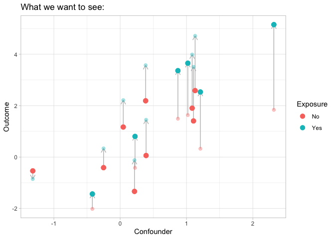
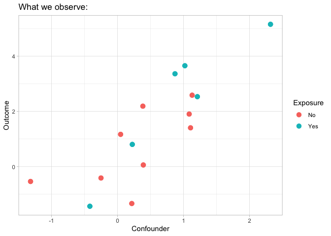

# 12 March 2025

## 1. Data generative model of potential outcomes

### 1.1 Single binary exposure case

Suppose the residuals

are independent and randomly drawn from distribution
,
and
![\mathbb{E}\[\epsilon\] = 0](https://latex.codecogs.com/svg.latex?%5Cmathbb%7BE%7D%5B%5Cepsilon%5D%20%3D%200 "\mathbb{E}[\epsilon] = 0").

The potential outcome of unit
 can maybe represented
by

![Y_i(x_i, u_i) = f(x_i, u_i) + \epsilon_i, \\\epsilon_i \sim \mathcal{P}, \mathbb{E}\[\epsilon\] = 0,](https://latex.codecogs.com/svg.latex?Y_i%28x_i%2C%20u_i%29%20%3D%20f%28x_i%2C%20u_i%29%20%2B%20%5Cepsilon_i%2C%20%5C%20%5Cepsilon_i%20%5Csim%20%5Cmathcal%7BP%7D%2C%20%5Cmathbb%7BE%7D%5B%5Cepsilon%5D%20%3D%200%2C "Y_i(x_i, u_i) = f(x_i, u_i) + \epsilon_i, \ \epsilon_i \sim \mathcal{P}, \mathbb{E}[\epsilon] = 0,")

where
")
is a function of both treatment
 and the
confounder .

The expectation of potential outcomes are:

![\theta^{(0)} := \mathbb{E}\[Y(0)\] = \mathbb{E}\_U \left\[ f(0, u) \right\], \\
\theta^{(1)} := \mathbb{E}\[Y(1)\] = \mathbb{E}\_U \left\[ f(1, u) \right\].](https://latex.codecogs.com/svg.latex?%5Ctheta%5E%7B%280%29%7D%20%3A%3D%20%5Cmathbb%7BE%7D%5BY%280%29%5D%20%3D%20%5Cmathbb%7BE%7D_U%20%5Cleft%5B%20f%280%2C%20u%29%20%5Cright%5D%2C%20%5C%5C%0A%5Ctheta%5E%7B%281%29%7D%20%3A%3D%20%5Cmathbb%7BE%7D%5BY%281%29%5D%20%3D%20%5Cmathbb%7BE%7D_U%20%5Cleft%5B%20f%281%2C%20u%29%20%5Cright%5D. "\theta^{(0)} := \mathbb{E}[Y(0)] = \mathbb{E}_U \left[ f(0, u) \right], \\
\theta^{(1)} := \mathbb{E}[Y(1)] = \mathbb{E}_U \left[ f(1, u) \right].")

Here, let
![\theta^{(x)} := \mathbb{E}\[Y(x)\], \\ x = 0,1](https://latex.codecogs.com/svg.latex?%5Ctheta%5E%7B%28x%29%7D%20%3A%3D%20%5Cmathbb%7BE%7D%5BY%28x%29%5D%2C%20%5C%2C%20x%20%3D%200%2C1 "\theta^{(x)} := \mathbb{E}[Y(x)], \, x = 0,1").

According to the **consistency assumption** (i.e., SUTVA), the observed
outcome  is either
") or
"):

![Y_i := Y_i(1, u_i) X_i + Y_i(0, u_i) (1 - X_i) = Y_i(1, u_i) \cdot \mathbb{I}\[X_i = 1\] + Y_i(0, u_i) \cdot \mathbb{I}\[X_i = 0\] \\
= \begin{cases}
Y_i(1, u_i), \text{ if } X_i = 1 \\
Y_i(0, u_i), \text{ if } X_i = 0.
\end{cases}](https://latex.codecogs.com/svg.latex?Y_i%20%3A%3D%20Y_i%281%2C%20u_i%29%20X_i%20%2B%20Y_i%280%2C%20u_i%29%20%281%20-%20X_i%29%20%3D%20Y_i%281%2C%20u_i%29%20%5Ccdot%20%5Cmathbb%7BI%7D%5BX_i%20%3D%201%5D%20%2B%20Y_i%280%2C%20u_i%29%20%5Ccdot%20%5Cmathbb%7BI%7D%5BX_i%20%3D%200%5D%20%5C%5C%0A%3D%20%5Cbegin%7Bcases%7D%0AY_i%281%2C%20u_i%29%2C%20%5Ctext%7B%20if%20%7D%20X_i%20%3D%201%20%5C%5C%0AY_i%280%2C%20u_i%29%2C%20%5Ctext%7B%20if%20%7D%20X_i%20%3D%200.%0A%5Cend%7Bcases%7D "Y_i := Y_i(1, u_i) X_i + Y_i(0, u_i) (1 - X_i) = Y_i(1, u_i) \cdot \mathbb{I}[X_i = 1] + Y_i(0, u_i) \cdot \mathbb{I}[X_i = 0] \\
= \begin{cases}
Y_i(1, u_i), \text{ if } X_i = 1 \\
Y_i(0, u_i), \text{ if } X_i = 0.
\end{cases}")

The confounder  affects
the treatment assignments
, i.e.,
").

The followings are two figures of the relationships between potential
outcomes
, Y_i(1))"),
observed outcome ,
treatment , and
confounder . They are
from the lecture slides (lecture 2) of Causal Machine Learning (CPSC
538L) (thanks to Matias).

The solid points above are the observed outcomes, and the transparent
ones are the unobserved potential outcomes.

### 1.2 Single categorical exposure case

Suppose the exposure has three levels,
.
The definition of the potential outcome can be generalized as

![Y_i(x_i, u_i) = f(x_i, u_i) + \epsilon_i, \\\epsilon_i \sim \mathcal{P}, \mathbb{E}\[\epsilon\] = 0.](https://latex.codecogs.com/svg.latex?Y_i%28x_i%2C%20u_i%29%20%3D%20f%28x_i%2C%20u_i%29%20%2B%20%5Cepsilon_i%2C%20%5C%20%5Cepsilon_i%20%5Csim%20%5Cmathcal%7BP%7D%2C%20%5Cmathbb%7BE%7D%5B%5Cepsilon%5D%20%3D%200. "Y_i(x_i, u_i) = f(x_i, u_i) + \epsilon_i, \ \epsilon_i \sim \mathcal{P}, \mathbb{E}[\epsilon] = 0.")

The function
")
is a function of exposure level
 and confounder
. It is
nonparametric.

Let
![\theta^{(x)} := \mathbb{E}\[Y(x)\], \\x =0, 1, 2](https://latex.codecogs.com/svg.latex?%5Ctheta%5E%7B%28x%29%7D%20%3A%3D%20%5Cmathbb%7BE%7D%5BY%28x%29%5D%2C%20%5C%20x%20%3D0%2C%201%2C%202 "\theta^{(x)} := \mathbb{E}[Y(x)], \ x =0, 1, 2").
The expectations of potential outcome are

![\theta^{(0)} := \mathbb{E}\[Y(0)\] = \mathbb{E}\_U\[f(0, u)\], \\
\theta^{(1)} := \mathbb{E}\[Y(1)\] = \mathbb{E}\_U\[f(1, u)\], \\
\theta^{(2)} := \mathbb{E}\[Y(2)\] = \mathbb{E}\_U\[f(2, u)\].](https://latex.codecogs.com/svg.latex?%5Ctheta%5E%7B%280%29%7D%20%3A%3D%20%5Cmathbb%7BE%7D%5BY%280%29%5D%20%3D%20%5Cmathbb%7BE%7D_U%5Bf%280%2C%20u%29%5D%2C%20%5C%5C%0A%5Ctheta%5E%7B%281%29%7D%20%3A%3D%20%5Cmathbb%7BE%7D%5BY%281%29%5D%20%3D%20%5Cmathbb%7BE%7D_U%5Bf%281%2C%20u%29%5D%2C%20%5C%5C%0A%5Ctheta%5E%7B%282%29%7D%20%3A%3D%20%5Cmathbb%7BE%7D%5BY%282%29%5D%20%3D%20%5Cmathbb%7BE%7D_U%5Bf%282%2C%20u%29%5D. "\theta^{(0)} := \mathbb{E}[Y(0)] = \mathbb{E}_U[f(0, u)], \\
\theta^{(1)} := \mathbb{E}[Y(1)] = \mathbb{E}_U[f(1, u)], \\
\theta^{(2)} := \mathbb{E}[Y(2)] = \mathbb{E}_U[f(2, u)].")

The observed outcome is then one of the potential outcomes:

![Y_i := \sum\_{x=0}^2 Y_i(x, u_i) \cdot \mathbb{I}\[X_i = x\]](https://latex.codecogs.com/svg.latex?Y_i%20%3A%3D%20%5Csum_%7Bx%3D0%7D%5E2%20Y_i%28x%2C%20u_i%29%20%5Ccdot%20%5Cmathbb%7BI%7D%5BX_i%20%3D%20x%5D "Y_i := \sum_{x=0}^2 Y_i(x, u_i) \cdot \mathbb{I}[X_i = x]")

### 1.3 Multiple categorical exposures case

Suppose

are the categorical exposures, where
.

**(Additive Assumption)** Assume the effect of exposures are
**additive**. That is,

![Y_i(\mathbf{x}\_i, u_i) = \sum\_{j=1}^p f_j(x\_{ij}, u_i) + \epsilon_i, \epsilon_i \sim \mathcal{P}, \mathbb{E}\[\epsilon\] = 0.](https://latex.codecogs.com/svg.latex?Y_i%28%5Cmathbf%7Bx%7D_i%2C%20u_i%29%20%3D%20%5Csum_%7Bj%3D1%7D%5Ep%20f_j%28x_%7Bij%7D%2C%20u_i%29%20%2B%20%5Cepsilon_i%2C%20%5Cepsilon_i%20%5Csim%20%5Cmathcal%7BP%7D%2C%20%5Cmathbb%7BE%7D%5B%5Cepsilon%5D%20%3D%200. "Y_i(\mathbf{x}_i, u_i) = \sum_{j=1}^p f_j(x_{ij}, u_i) + \epsilon_i, \epsilon_i \sim \mathcal{P}, \mathbb{E}[\epsilon] = 0.")

Let
![\theta_j^{(x)}:= \mathbb{E}\[Y\_{\[j\]}(x)\], x =0, 1, 2](https://latex.codecogs.com/svg.latex?%5Ctheta_j%5E%7B%28x%29%7D%3A%3D%20%5Cmathbb%7BE%7D%5BY_%7B%5Bj%5D%7D%28x%29%5D%2C%20x%20%3D0%2C%201%2C%202 "\theta_j^{(x)}:= \mathbb{E}[Y_{[j]}(x)], x =0, 1, 2"),
and
![\mathbb{E}\[Y\_{\[j\]}(x)\]](https://latex.codecogs.com/svg.latex?%5Cmathbb%7BE%7D%5BY_%7B%5Bj%5D%7D%28x%29%5D "\mathbb{E}[Y_{[j]}(x)]")
is the **marginal expectation** of the potential outcome of
. Then

![\theta_j^{(x)} := \mathbb{E}\left\[Y\_{\[j\]}(x) \right\] = \mathbb{E}\_U\[f_j(x, u)\].](https://latex.codecogs.com/svg.latex?%5Ctheta_j%5E%7B%28x%29%7D%20%3A%3D%20%5Cmathbb%7BE%7D%5Cleft%5BY_%7B%5Bj%5D%7D%28x%29%20%5Cright%5D%20%3D%20%5Cmathbb%7BE%7D_U%5Bf_j%28x%2C%20u%29%5D. "\theta_j^{(x)} := \mathbb{E}\left[Y_{[j]}(x) \right] = \mathbb{E}_U[f_j(x, u)].")

> As
> [wikipedia](https://en.wikipedia.org/wiki/Generalized_additive_model#:~:text=In%20statistics%2C%20a%20generalized%20additive,inference%20about%20these%20smooth%20functions.)
> says, for an generalized additive model (GAM) that has a form of
>
> ![g(\mathbb{E}\[Y\]) = \beta_0 + f_1(x_1) + \cdots + f_m(x_m),](https://latex.codecogs.com/svg.latex?g%28%5Cmathbb%7BE%7D%5BY%5D%29%20%3D%20%5Cbeta_0%20%2B%20f_1%28x_1%29%20%2B%20%5Ccdots%20%2B%20f_m%28x_m%29%2C "g(\mathbb{E}[Y]) = \beta_0 + f_1(x_1) + \cdots + f_m(x_m),")
>
> the functions
> ")
> may be a specific parametric form, or may be specified
> non-parametrically or semi-parametrically to be estimated by
> nonparametric regression **mean**.

## 2. Inverse probability weighting for categorical exposure

> References:
>
> [Lopez, Michael J., and Roee Gutman. “Estimation of causal effects
> with multiple treatments: a review and new ideas.” Statistical Science
> (2017):
> 432-454.](https://www.jstor.org/stable/26408300?casa_token=-5_OEfHq7BIAAAAA%3AeZdAbpuGv07p6R1mlxMgjHXojX89-Drz306yXzS4h3c06roPs-sxydq7Ga4wII4ctjiyqBq4-M6Oq27pjbk4MxgJMKQlCmUhEtMWwr-5tz_OIkeB0kim&seq=1)
>
> [Imbens, Guido W. “The role of the propensity score in estimating
> dose-response f unctions.” Biometrika 87.3 (2000):
> 706-710.](https://www.jstor.org/stable/2673642)
>
> [Li, Fan. “PROPENSITY SCORE WEIGHTING FOR CAUSAL INFERENCE WITH
> MULTIPLE TREATMENTS.” The Annals of Applied Statistics, vol. 13, no.
> 4, 2019, pp. 2389–415. JSTOR,
> https://www.jstor.org/stable/26866728.](https://www.jstor.org/stable/26866728)

Start from the binary exposure case.

Recall Figure 1 & 2.

Extended from binary exposure case:

Define the **generalized propensity score** as the probability of being
assigned to treatment value
 given the confounder
value :

 = \operatorname{Pr}(X_i=x|U_i=u_i).")

The generalized propensity score can be estimated by any statistical
models.

## 3. Identification assumptions for multiple exposures

(The blessing of multiple causes, Wang 2020)

## 4. Residuals?

> [Athey, Susan, et al. “Approximate Residual Balancing: Debiased
> Inference of Average Treatment Effects in High Dimensions.” Journal of
> the Royal Statistical Society. Series B (Statistical Methodology),
> vol. 80, no. 4, 2018, pp. 597–623. JSTOR,
> https://www.jstor.org/stable/26773172.](https://www.jstor.org/stable/26773172)
