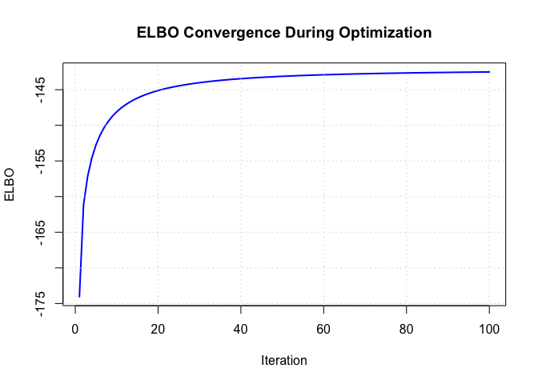
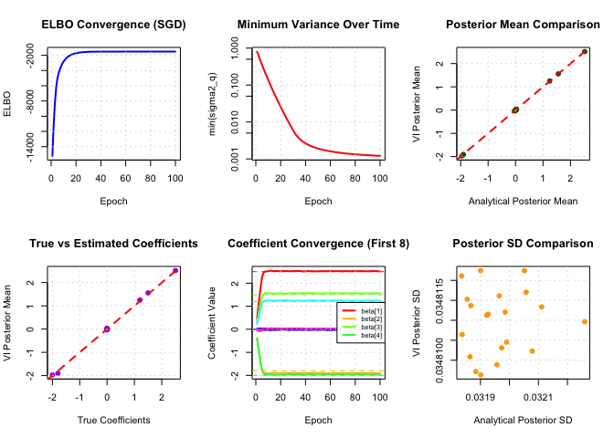

# Pure Variational Inference on Fitting a SuSiE model
Ming Yuan
2026-01-23

## Overview of variational inference

Suppose $x$ is the data, and $\theta$ is the parameter of the model.

There is a complicated probability distribution, e.g., the posterior
distribution of $\theta$, i.e. $p(\theta \mid x)$, that we want to
understand. However, its computation can be intractable. Instead of
directly figuring out its explicit close-form solution, we can choose a
simpler **family** of distributions $q(\theta)$ and find the member of
that family closest to the target distribution to approximate
$p(\theta\mid x)$.

That is, it becomes an optimization problem, which can usually be faster
than sampling methods, e.g., importance sampling and MCMC, when trying
to approximate the posterior distribution.

### How it works

The “closeness” between distributions can be measured by divergence,
e.g., KL-divergence is the most frequently used one. We search
$q(\theta)$ such that it minimizes the KL-divergence between itself and
$p(\theta \mid x)$.

The (reverse) KL-divergence between two probability distribution, $P(z)$
and $Q(z)$, is given by, This can also be written as:

$$
\text{KL}(Q||P) = \mathbb{E}_Q[\log Q(z) - \log P(z)]
$$

where the expectation is taken with respect to $Q$. In continuous cases,
it is equivalently to

$$
\text{KL}(Q||P) = \int Q(z) \log\frac{Q(z)}{P(z)} dx
$$

The reverse KL is commonly used in variational inference, where $Q$ is
the approximating distribution and $P$ is the target distribution,
because it’s often easier to compute expectations under $Q$.

In terms of **variational inference** where the target function is the
posterior distribution
$p(\theta \mid x) \propto p(x \mid \theta) \cdot p(\theta)$, the
KL-divergence is equivalent to:

$$
\text{KL}(q || p) = \log p(x) - \mathbb{E}_q \left[\log \frac{p(x \mid \theta) p(\theta)}{q(\theta)} \right].
$$

Here, the first part of the right-hand side is the log of marginal
distribution of data $p(x)$, which is usually intractable; the second
part is called **evidence of lower bound (ELBO)**, which is constructed
by all the known components, including the prior distribution
$p(\theta)$, the likelihood function $p(x\mid \theta)$, and the
variational distribution $q(\theta)$. Therefore, minimizing the
KL-divergence is equivalent to **maximizing the ELBO**.

The ELBO has an elegant decomposition: it balances fitting the data well
(likelihood term) against keeping your approximation close to *prior
beliefs (regularization term)*.

### Tradeoff

A limitation of this approach is that the chosen family of distribution
is restricted. If the true posterior distribution has a complex shape
but we choose a simple family, the approximation might lose some
important features.

## Overview 2: Stochastic gradient descent

**Stochastic Gradient Descent (SGD)** is an optimization algorithm that
is widely used in machine learning, particularly for large-scale
problems. Unlike standard **batch gradient descent**, which computes the
gradient using all training samples in each iteration, SGD updates
parameters based on a small random subset (mini-batch) of the data.

### Key Idea

In batch gradient descent, we compute the gradient of the objective
function (e.g., ELBO in variational inference) using the entire dataset:

$$
\theta_{t+1} = \theta_t + \eta \nabla_\theta \mathcal{L}(\theta; \text{all data})
$$

In SGD, we randomly sample a mini-batch $\mathcal{B}_t$ and approximate
the gradient:

$$
\theta_{t+1} = \theta_t + \eta \nabla_\theta \mathcal{L}(\theta; \mathcal{B}_t)
$$

The gradient computed on a mini-batch is a **noisy estimate** of the
true gradient, but with proper scaling (multiplying by
$n/|\mathcal{B}_t|$ where $n$ is the total sample size), it is unbiased
in expectation.

### Advantages

1.  **Computational Efficiency**: Each iteration is much faster since it
    only processes a small subset of data
2.  **Memory Efficiency**: Only needs to load mini-batches into memory,
    enabling training on datasets larger than available RAM
3.  **Scalability**: Makes optimization feasible for massive datasets
    where batch methods would be prohibitively slow
4.  **Regularization Effect**: The noise in gradient estimates can help
    escape local minima and poor saddle points

### Challenges

1.  **Noisy Convergence**: The stochastic gradients introduce noise,
    leading to more erratic optimization trajectories
2.  **Hyperparameter Tuning**: Requires careful selection of learning
    rate and batch size
3.  **Variance**: High variance in gradient estimates can slow
    convergence

To address these challenges, practitioners typically use: - **Learning
rate schedules** (decay over time) - **Gradient clipping** (bound
gradient norms to prevent instability) - **Momentum** or **adaptive
methods** like Adam (though we use vanilla SGD here for simplicity)

## A Simple Example: Simple Linear Regression Model

Suppose we have $n$ samples, $i=1, \ldots, n$; $x$ and $y$ are the
corresponding input and output. We have a linear regression model, given
by

$$
y_i = x_i\beta + \epsilon_i, \epsilon_i {}{}\sim N(0, \sigma^2) \text{i.i.d},
$$

and the coefficient $\beta$ follows a prior distribution
$\beta \sim N(0, \sigma_0^2)$. Then, analytically, the Bayesian
posterior distribution of $\beta$ is tractable, given by

$$
\beta | \mathbf{x, y} \sim N\left(\mu_1, \sigma_1^2\right), 
$$

where

$$
\sigma_1^2 = \left[ \frac{\sum_i x_i^2}{\sigma^2} + \frac{1}{\sigma_0^2} \right]^{-1},  \quad 
\mu_1 =  \frac{\sigma_1^2}{\sigma^2} \cdot \sum_{i}x_i y_i.
$$

OK. Now, we want to use variational inference to approximate it.

``` r
# Set seed for reproducibility
set.seed(123)

# True parameter values
n <- 100              # number of samples
beta_true <- 2.5      # true coefficient
sigma2 <- 1.0         # noise variance
sigma2_0 <- 4.0       # prior variance

# Simulate data
x <- rnorm(n, mean = 0, sd = 1)
y <- x * beta_true + rnorm(n, mean = 0, sd = sqrt(sigma2))

# Analytical posterior (true solution)
sigma2_1_analytical <- 1 / (sum(x^2) / sigma2 + 1 / sigma2_0)
mu_1_analytical <- (sigma2_1_analytical / sigma2) * sum(x * y)

cat("Analytical Posterior:\n")
```

    Analytical Posterior:

``` r
cat(sprintf("  Mean: %.4f\n", mu_1_analytical))
```

      Mean: 2.4291

``` r
cat(sprintf("  Variance: %.4f\n", sigma2_1_analytical))
```

      Variance: 0.0120

``` r
cat(sprintf("  SD: %.4f\n\n", sqrt(sigma2_1_analytical)))
```

      SD: 0.1094

``` r
# Variational Inference: maximize ELBO
# Variational family: q(beta) ~ N(mu_q, sigma2_q)

# ELBO function
compute_elbo <- function(params, x, y, sigma2, sigma2_0) {
  mu_q <- params[1]
  log_sigma2_q <- params[2]  # use log for positivity constraint
  sigma2_q <- exp(log_sigma2_q)

  n <- length(y)

  # E_q[log p(y | x, beta)]
  # = -n/2 * log(2*pi*sigma2) - 1/(2*sigma2) * sum((y_i - x_i*beta)^2)
  # E_q[(y_i - x_i*beta)^2] = y_i^2 - 2*y_i*x_i*mu_q + x_i^2*(mu_q^2 + sigma2_q)
  expected_lik <- -n/2 * log(2*pi*sigma2) -
    1/(2*sigma2) * sum(y^2 - 2*y*x*mu_q + x^2*(mu_q^2 + sigma2_q))

  # E_q[log p(beta)] where beta ~ N(0, sigma2_0)
  # = -1/2 * log(2*pi*sigma2_0) - 1/(2*sigma2_0) * E_q[beta^2]
  # E_q[beta^2] = mu_q^2 + sigma2_q
  expected_prior <- -1/2 * log(2*pi*sigma2_0) -
    1/(2*sigma2_0) * (mu_q^2 + sigma2_q)

  # Entropy: -E_q[log q(beta)]
  # For Gaussian: 1/2 * log(2*pi*e*sigma2_q) = 1/2 + 1/2*log(2*pi*sigma2_q)
  entropy <- 1/2 * (1 + log(2*pi*sigma2_q))

  elbo <- expected_lik + expected_prior + entropy
  return(elbo)
}

# Gradient of ELBO (for optimization)
gradient_elbo <- function(params, x, y, sigma2, sigma2_0) {
  mu_q <- params[1]
  log_sigma2_q <- params[2]
  sigma2_q <- exp(log_sigma2_q)

  # Gradient w.r.t. mu_q
  grad_mu <- (1/sigma2) * sum(x * (y - x*mu_q)) - mu_q/sigma2_0

  # Gradient w.r.t. log(sigma2_q) = gradient w.r.t. sigma2_q * sigma2_q
  grad_sigma2_q <- -1/(2*sigma2) * sum(x^2) - 1/(2*sigma2_0) + 1/(2*sigma2_q)
  grad_log_sigma2_q <- grad_sigma2_q * sigma2_q

  return(c(grad_mu, grad_log_sigma2_q))
}

# Initialize variational parameters
mu_q_init <- 0
sigma2_q_init <- 1
params_init <- c(mu_q_init, log(sigma2_q_init))

# Gradient ascent to maximize ELBO
learning_rate <- 0.01
n_iterations <- 100
params <- params_init
elbo_history <- numeric(n_iterations)

for (iter in 1:n_iterations) {
  # Compute gradient
  grad <- gradient_elbo(params, x, y, sigma2, sigma2_0)

  # Update parameters
  params <- params + learning_rate * grad

  # Store ELBO
  elbo_history[iter] <- compute_elbo(params, x, y, sigma2, sigma2_0)
}

# Extract final variational parameters
mu_q_final <- params[1]
sigma2_q_final <- exp(params[2])

cat("Variational Inference Results:\n")
```

    Variational Inference Results:

``` r
cat(sprintf("  Mean: %.4f\n", mu_q_final))
```

      Mean: 2.4291

``` r
cat(sprintf("  Variance: %.4f\n", sigma2_q_final))
```

      Variance: 0.0294

``` r
cat(sprintf("  SD: %.4f\n\n", sqrt(sigma2_q_final)))
```

      SD: 0.1715

``` r
cat("Comparison:\n")
```

    Comparison:

``` r
cat(sprintf("  True beta: %.4f\n", beta_true))
```

      True beta: 2.5000

``` r
cat(sprintf("  Analytical mean: %.4f\n", mu_1_analytical))
```

      Analytical mean: 2.4291

``` r
cat(sprintf("  VI mean: %.4f\n", mu_q_final))
```

      VI mean: 2.4291

``` r
cat(sprintf("  Difference: %.6f\n\n", abs(mu_1_analytical - mu_q_final)))
```

      Difference: 0.000000

``` r
cat(sprintf("  Analytical SD: %.4f\n", sqrt(sigma2_1_analytical)))
```

      Analytical SD: 0.1094

``` r
cat(sprintf("  VI SD: %.4f\n", sqrt(sigma2_q_final)))
```

      VI SD: 0.1715

``` r
cat(sprintf("  Difference: %.6f\n", abs(sqrt(sigma2_1_analytical) - sqrt(sigma2_q_final))))
```

      Difference: 0.062083

``` r
# Plot ELBO convergence
plot(elbo_history, type = 'l',
     xlab = 'Iteration', ylab = 'ELBO',
     main = 'ELBO Convergence During Optimization',
     col = 'blue', lwd = 2)
grid()
```



Great. Now let’s turn to a multiple regression model. Suppose we have
$n$ samples, $i=1, \ldots, n$; $x$ and $y$ are the corresponding input
and output. We have a linear regression model, given by

$$
y_i = x_{i1}\beta_1 + \cdots + x_{ip} \beta_p + \epsilon_i, \epsilon_i \sim N(0, \sigma^2) \text{i.i.d},
$$

The easiest variational distribution is the (complete) mean-field
approximation, given by

$$
q(\mathbf{\beta}) = \prod_{j=1}^p q_j(\beta_j), \quad q_j (\beta_j) \sim N(\mu_j, \sigma_j^2)
$$

Notice that this variational distribution is unable to capture the
correlations between variables, as it implicitly assumes all variables
are independent.

## Another example: Multiple Regression with Stochastic Gradient Descent

Now let’s implement a simulation study for multiple linear regression
with variational inference using **stochastic gradient descent (SGD)**.
Unlike batch gradient descent which uses all data points to compute
gradients, SGD uses random mini-batches, making it more scalable for
large datasets.

``` r
# Set seed for reproducibility
set.seed(42)

# Simulation parameters
n <- 1000              # number of samples
p <- 20                # number of variables
sigma2 <- 1.0          # noise variance
sigma2_0 <- 2.0        # prior variance for each beta_j

# Generate true coefficients (sparse signal)
beta_true <- numeric(p)
# Only first 5 coefficients are non-zero
beta_true[1:5] <- c(2.5, -1.8, 1.5, -2.0, 1.2)

# Generate design matrix X (standardized)
X <- matrix(rnorm(n * p), nrow = n, ncol = p)
# Standardize columns
X <- scale(X)

# Generate response y
y <- X %*% beta_true + rnorm(n, mean = 0, sd = sqrt(sigma2))

cat("Data Generation:\n")
```

    Data Generation:

``` r
cat(sprintf("  Sample size n: %d\n", n))
```

      Sample size n: 1000

``` r
cat(sprintf("  Number of variables p: %d\n", p))
```

      Number of variables p: 20

``` r
cat(sprintf("  Number of non-zero coefficients: %d\n", sum(beta_true != 0)))
```

      Number of non-zero coefficients: 5

``` r
cat(sprintf("  Signal-to-noise ratio: %.2f\n\n", var(X %*% beta_true) / sigma2))
```

      Signal-to-noise ratio: 17.15

``` r
# Analytical posterior (for comparison)
# With N(0, sigma2_0) priors: beta | X, y ~ N(mu_post, Sigma_post)
# Sigma_post = (X'X/sigma2 + I/sigma2_0)^{-1}
# mu_post = Sigma_post * (X'y/sigma2)

Sigma_post_analytical <- solve(t(X) %*% X / sigma2 + diag(p) / sigma2_0)
mu_post_analytical <- Sigma_post_analytical %*% (t(X) %*% y / sigma2)

cat("Analytical Posterior (first 8 coefficients):\n")
```

    Analytical Posterior (first 8 coefficients):

``` r
for (j in 1:min(8, p)) {
  cat(sprintf("  beta[%d]: true=%.3f, post_mean=%.3f, post_sd=%.3f\n",
              j, beta_true[j], mu_post_analytical[j],
              sqrt(Sigma_post_analytical[j, j])))
}
```

      beta[1]: true=2.500, post_mean=2.522, post_sd=0.032
      beta[2]: true=-1.800, post_mean=-1.898, post_sd=0.032
      beta[3]: true=1.500, post_mean=1.557, post_sd=0.032
      beta[4]: true=-2.000, post_mean=-1.961, post_sd=0.032
      beta[5]: true=1.200, post_mean=1.243, post_sd=0.032
      beta[6]: true=0.000, post_mean=-0.024, post_sd=0.032
      beta[7]: true=0.000, post_mean=0.013, post_sd=0.032
      beta[8]: true=0.000, post_mean=0.020, post_sd=0.032

``` r
cat("\n")
```

``` r
# Variational Inference with SGD
# Variational family: q(beta) = prod_j N(beta_j | mu_j, sigma2_j)

# ELBO function (for full data)
compute_elbo_multiple <- function(mu_q, sigma2_q, X, y, sigma2, sigma2_0) {
  n <- nrow(X)
  p <- ncol(X)

  # Expected squared predictions
  # E_q[(X*beta)^2] = sum_i sum_j sum_k X_ij X_ik E[beta_j beta_k]
  # E[beta_j beta_k] = mu_j * mu_k (j != k), mu_j^2 + sigma2_j (j == k)
  Xmu <- X %*% mu_q
  expected_pred_squared <- sum(Xmu^2) + sum((X^2) %*% sigma2_q)

  # E_q[log p(y | X, beta)]
  expected_lik <- -n/2 * log(2*pi*sigma2) -
    1/(2*sigma2) * (sum(y^2) - 2*sum(y * Xmu) + expected_pred_squared)

  # E_q[log p(beta)]
  expected_prior <- -p/2 * log(2*pi*sigma2_0) -
    1/(2*sigma2_0) * sum(mu_q^2 + sigma2_q)

  # Entropy: sum_j [1/2 * (1 + log(2*pi*sigma2_j))]
  entropy <- sum(1/2 * (1 + log(2*pi*sigma2_q)))

  elbo <- expected_lik + expected_prior + entropy
  return(elbo)
}

# Stochastic gradient of ELBO (using mini-batch)
stochastic_gradient <- function(mu_q, log_sigma2_q, X_batch, y_batch,
                                 sigma2, sigma2_0, n_total) {
  n_batch <- nrow(X_batch)
  p <- length(mu_q)
  sigma2_q <- exp(log_sigma2_q)

  # Scale factor to account for mini-batch vs full data
  scale_factor <- n_total / n_batch

  # Gradient w.r.t. mu_q
  # From likelihood term (scaled by n_total/n_batch)
  residuals <- y_batch - X_batch %*% mu_q
  grad_mu_lik <- (1/sigma2) * t(X_batch) %*% residuals * scale_factor

  # From prior term
  grad_mu_prior <- -mu_q / sigma2_0

  grad_mu <- grad_mu_lik + grad_mu_prior

  # Gradient w.r.t. log(sigma2_q)
  # From likelihood term (scaled)
  grad_sigma2_lik <- -1/(2*sigma2) * colSums(X_batch^2) * scale_factor

  # From prior and entropy
  grad_sigma2_other <- -1/(2*sigma2_0) + 1/(2*sigma2_q)

  grad_sigma2 <- grad_sigma2_lik + grad_sigma2_other
  grad_log_sigma2 <- grad_sigma2 * sigma2_q

  return(list(grad_mu = as.vector(grad_mu),
              grad_log_sigma2 = as.vector(grad_log_sigma2)))
}

# SGD optimization
batch_size <- 50
n_epochs <- 100
learning_rate_init <- 0.005  # Reduced initial learning rate for stability

# Initialize variational parameters
mu_q <- rep(0, p)
sigma2_q <- rep(1, p)
log_sigma2_q <- log(sigma2_q)

# Storage for monitoring
elbo_history <- numeric(n_epochs)
mu_history <- matrix(0, nrow = n_epochs, ncol = min(8, p))
sigma2_min_history <- numeric(n_epochs)  # Track minimum variance

# Constraint parameters
min_log_sigma2 <- log(1e-6)  # Minimum variance to prevent numerical issues
max_grad_norm <- 10.0        # Gradient clipping threshold

# SGD loop
cat("Running Stochastic Gradient Descent...\n")
```

    Running Stochastic Gradient Descent...

``` r
for (epoch in 1:n_epochs) {
  # Learning rate decay
  learning_rate <- learning_rate_init / (1 + epoch/50)

  # Shuffle data
  indices <- sample(1:n)
  X_shuffled <- X[indices, , drop = FALSE]
  y_shuffled <- y[indices]

  # Mini-batch updates
  n_batches <- ceiling(n / batch_size)
  for (batch in 1:n_batches) {
    start_idx <- (batch - 1) * batch_size + 1
    end_idx <- min(batch * batch_size, n)

    X_batch <- X_shuffled[start_idx:end_idx, , drop = FALSE]
    y_batch <- y_shuffled[start_idx:end_idx]

    # Compute stochastic gradients
    grads <- stochastic_gradient(mu_q, log_sigma2_q, X_batch, y_batch,
                                  sigma2, sigma2_0, n)

    # Gradient clipping to prevent instability
    grad_mu_norm <- sqrt(sum(grads$grad_mu^2))
    if (grad_mu_norm > max_grad_norm) {
      grads$grad_mu <- grads$grad_mu * (max_grad_norm / grad_mu_norm)
    }

    grad_log_sigma2_norm <- sqrt(sum(grads$grad_log_sigma2^2))
    if (grad_log_sigma2_norm > max_grad_norm) {
      grads$grad_log_sigma2 <- grads$grad_log_sigma2 * (max_grad_norm / grad_log_sigma2_norm)
    }

    # Update parameters
    mu_q <- mu_q + learning_rate * grads$grad_mu
    log_sigma2_q <- log_sigma2_q + learning_rate * grads$grad_log_sigma2

    # Enforce lower bound on log_sigma2_q to prevent variance collapse
    log_sigma2_q <- pmax(log_sigma2_q, min_log_sigma2)
  }

  # Compute full ELBO for monitoring
  sigma2_q <- exp(log_sigma2_q)
  elbo_history[epoch] <- compute_elbo_multiple(mu_q, sigma2_q, X, y, sigma2, sigma2_0)
  mu_history[epoch, ] <- mu_q[1:min(8, p)]
  sigma2_min_history[epoch] <- min(sigma2_q)

  if (epoch %% 20 == 0) {
    cat(sprintf("  Epoch %d: ELBO = %.2f, min(sigma2_q) = %.6f\n",
                epoch, elbo_history[epoch], min(sigma2_q)))
  }
}
```

      Epoch 20: ELBO = -1727.95, min(sigma2_q) = 0.025605
      Epoch 40: ELBO = -1520.68, min(sigma2_q) = 0.002650
      Epoch 60: ELBO = -1515.47, min(sigma2_q) = 0.001607
      Epoch 80: ELBO = -1514.24, min(sigma2_q) = 0.001332
      Epoch 100: ELBO = -1513.96, min(sigma2_q) = 0.001212

``` r
cat("\nVariational Inference Results (first 8 coefficients):\n")
```


    Variational Inference Results (first 8 coefficients):

``` r
for (j in 1:min(8, p)) {
  cat(sprintf("  beta[%d]: true=%.3f, VI_mean=%.3f, VI_sd=%.3f\n",
              j, beta_true[j], mu_q[j], sqrt(sigma2_q[j])))
}
```

      beta[1]: true=2.500, VI_mean=2.517, VI_sd=0.035
      beta[2]: true=-1.800, VI_mean=-1.908, VI_sd=0.035
      beta[3]: true=1.500, VI_mean=1.557, VI_sd=0.035
      beta[4]: true=-2.000, VI_mean=-1.969, VI_sd=0.035
      beta[5]: true=1.200, VI_mean=1.250, VI_sd=0.035
      beta[6]: true=0.000, VI_mean=-0.025, VI_sd=0.035
      beta[7]: true=0.000, VI_mean=0.010, VI_sd=0.035
      beta[8]: true=0.000, VI_mean=0.018, VI_sd=0.035

``` r
cat("\nComparison of Posterior Means:\n")
```


    Comparison of Posterior Means:

``` r
cat(sprintf("  Max absolute difference: %.6f\n",
            max(abs(mu_q - mu_post_analytical))))
```

      Max absolute difference: 0.009491

``` r
cat(sprintf("  Mean squared error: %.6f\n",
            mean((mu_q - mu_post_analytical)^2)))
```

      Mean squared error: 0.000016

``` r
cat(sprintf("  Correlation: %.6f\n\n",
            cor(mu_q, mu_post_analytical)))
```

      Correlation: 0.999995

``` r
# Visualization
par(mfrow = c(2, 3))

# Plot 1: ELBO convergence
plot(elbo_history, type = 'l',
     xlab = 'Epoch', ylab = 'ELBO',
     main = 'ELBO Convergence (SGD)',
     col = 'blue', lwd = 2)
grid()

# Plot 2: Minimum variance over time (diagnostic)
plot(sigma2_min_history, type = 'l',
     xlab = 'Epoch', ylab = 'min(sigma2_q)',
     main = 'Minimum Variance Over Time',
     col = 'red', lwd = 2, log = 'y')
abline(h = exp(min_log_sigma2), col = 'darkred', lty = 2, lwd = 2)
text(n_epochs * 0.7, exp(min_log_sigma2) * 2,
     'Lower bound', col = 'darkred', cex = 0.8)
grid()

# Plot 3: Posterior means comparison
plot(mu_post_analytical, mu_q,
     xlab = 'Analytical Posterior Mean',
     ylab = 'VI Posterior Mean',
     main = 'Posterior Mean Comparison',
     pch = 19, col = 'darkgreen')
abline(0, 1, col = 'red', lwd = 2, lty = 2)
grid()

# Plot 4: True vs estimated coefficients
plot(beta_true, mu_q,
     xlab = 'True Coefficients',
     ylab = 'VI Posterior Mean',
     main = 'True vs Estimated Coefficients',
     pch = 19, col = 'purple')
abline(0, 1, col = 'red', lwd = 2, lty = 2)
grid()

# Plot 5: Convergence of first few coefficients
matplot(mu_history, type = 'l', lty = 1, lwd = 2,
        xlab = 'Epoch', ylab = 'Coefficient Value',
        main = 'Coefficient Convergence (First 8)',
        col = rainbow(ncol(mu_history)))
abline(h = beta_true[1:min(8, p)], lty = 2, col = rainbow(min(8, p)))
legend('right', legend = paste0('beta[', 1:min(4, p), ']'),
       col = rainbow(min(8, p))[1:min(4, p)],
       lty = 1, lwd = 2, cex = 0.7)
grid()

# Plot 6: Posterior variance comparison
sigma_post_analytical_diag <- sqrt(diag(Sigma_post_analytical))
plot(sigma_post_analytical_diag, sqrt(sigma2_q),
     xlab = 'Analytical Posterior SD',
     ylab = 'VI Posterior SD',
     main = 'Posterior SD Comparison',
     pch = 19, col = 'orange')
abline(0, 1, col = 'red', lwd = 2, lty = 2)
grid()
```



``` r
par(mfrow = c(1, 1))
```

> ### Key Features of This Implementation:
>
> 1.  **Stochastic Gradient Descent**: Uses mini-batches (size 50)
>     instead of full data for gradient computation, making it scalable
>     to large datasets.
> 2.  **Learning Rate Decay**: The learning rate decreases over epochs
>     as `lr_init / (1 + epoch/50)` for better convergence.
> 3.  **Mini-batch Scaling**: Gradients from mini-batches are scaled by
>     `n_total/n_batch` to properly approximate full-batch gradients.
> 4.  **Mean-field Approximation**: Uses independent Gaussian
>     distributions for each coefficient, which is computationally
>     tractable but cannot capture posterior correlations.
> 5.  **Numerical Stability Mechanisms \[IMPORTANT\]**:
>
> - **Gradient Clipping**: Limits gradient norms to prevent explosive
>   updates
> - **Variance Lower Bound**: Enforces `log_sigma2_q >= log(1e-6)` to
>   prevent variance collapse. This is very important since, without
>   this constraint, the variance parameters `singma2_q` can shrink
>   toward zero during optimization, especially when: - The learning
>   rate is too aggressive; / - Gradients push variance parameters into
>   numerically unstable regions; / - The log-space parameterization
>   allows `log_sigma2_q` to become extremely negative
> - **Conservative Learning Rate**: Uses smaller initial learning rate
>   (0.005) for stability
>
> 6.  **Monitoring**: Tracks ELBO, coefficient values, and minimum
>     variance to diagnose convergence issues.
